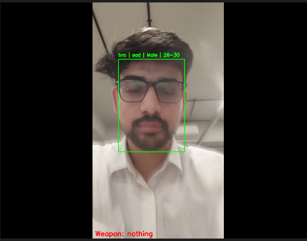
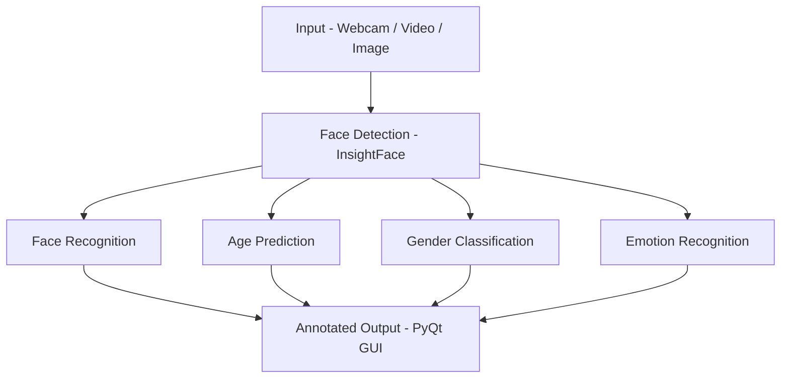

# Person Identity & Attribute Analysis System

A modular deep learning–based computer vision application for real-time **face detection, recognition, age prediction, gender classification, emotion analysis**, and **weapon detection (under development)**.

The system processes live webcam or video streams and performs multi-attribute facial analysis using deep learning models with optional GPU acceleration.

---

## 📸 Demo

<!-- Upload your screenshot inside an `assets/` folder and replace the file name below -->

*Example output showing real-time face detection with emotion, gender, and age prediction overlay.*

---

## 🚀 Features

- Real-time **Face Detection & Recognition** using InsightFace (ArcFace embeddings)
- **Age Prediction** using MobileNetV3 (PyTorch)
- **Gender Classification** using UTKFace-trained CNN model
- **Emotion Recognition** using CNN-based FER model
- Desktop GUI built with **PyQt**
- CUDA-enabled GPU acceleration
- Checkpoint-based training with resume capability
- **Gun Detection Module (YOLOv8)** – Currently under development

---

## 🧠 Models Used

| Module | Model |
|--------|--------|
| Face Detection & Recognition | InsightFace (ArcFace) |
| Age Prediction | MobileNetV3 (.pth) |
| Gender Classification | UTKFace CNN (.h5) |
| Emotion Recognition | CNN FER Model (.keras) |
| Gun Detection (WIP) | YOLOv8 |

---

## 🏗 System Architecture

---

### Why This Works
- All labels are wrapped in **double quotes**
- Parentheses are removed
- Special characters are avoided
- Compatible with GitHub Markdown renderer

---

If you want, I can now:

- Add the **Gun Detection (YOLOv8) module** into this diagram  
- Create a **training vs inference architecture diagram**  
- Make a more advanced system-level architecture diagram  
- Design a clean diagram for your project report (PDF ready)  

Tell me the level of detail you want.
